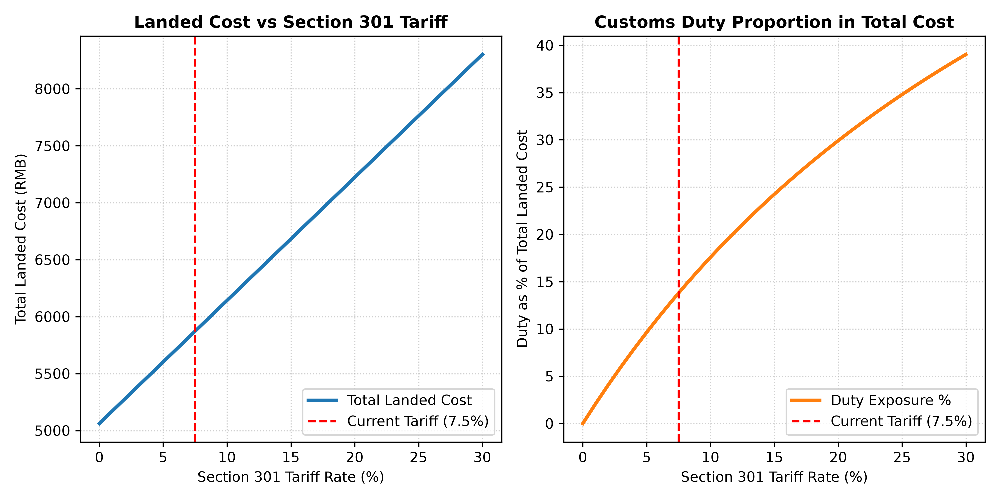
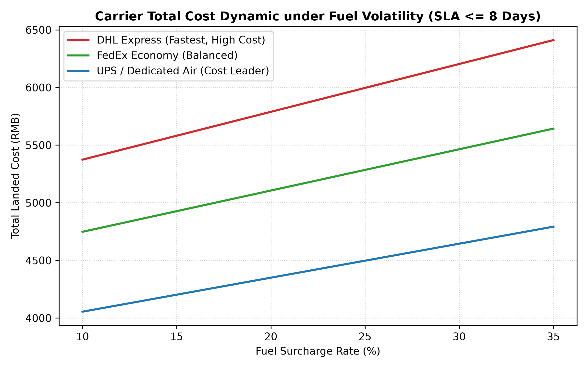

Markdown
# Medical  Logistics Cost Optimizer (CN to US)
   
- **Main Project： A Python tool to calculate landed costs and select carriers for exporting medical devices from China to the US. It compares courier pricing, handles dimensional weight rules, checks delivery deadlines (SLAs), and calculates US import tariffs.

## Features
- **Tariff Database (`init_db.py`):** Uses SQLite to store carrier rates (DHL, FedEx, UPS saver), transit days, and US Section 301 tariff rates for medical goods.
- **Cost Engine (`calculator.py`):** Calculates chargeable weight (actual vs dimensional weight) and total landed cost (freight + fuel surcharge + import duty).
- **Route Optimizer (`optimizer.py`):** Runs batch orders and finds Pareto-optimal choices between shipping cost and delivery speed.
- **Sensitivity Analysis (`analytics.py`):** Checks how cost changes under different tariff rates (0-30%) and fuel surcharges (10-35%).
- **Runner (`main.py`):** Runs the full pipeline from database setup to chart generation.


## Key Findings
- **Cost savings:** For orders that are not time-sensitive (deadline >= 8 days), switching to air cargo saver options cuts total shipping cost by **14% to 28%** compared to express shipping.
- **On-time delivery:** For urgent orders (deadline <= 5 days), the script automatically forces express options (like DHL) to avoid delivery delays.
- **Tariff impact:** Because medical monitors have a high declared value, import tariffs affect total cost much more than fuel price changes. If tariffs jump from 7.5% to 25%, taxes make up over 35% of the total landed cost.（according to the two png）

## Limitations & Future Work

This project is a functional proof-of-concept (PoC). In a real production environment, there are a few areas for further improvement:

- **Static Pricing Data:** The carrier rates in SQLite are manually collected baselines. A future version could connect to carrier open APIs (like FedEx or DHL developer APIs) to fetch live spot rates and fuel surcharges.
- **Order Consolidation:** Currently, the engine optimizes one shipment at a time. It does not yet handle warehouse order bundling (combining multiple small parcels into one pallet to save freight).
- **Two-Factor Optimization:** The Pareto frontier currently only balances cost versus delivery speed. We could also add a carrier reliability score (on-time delivery rate) as a third objective.

## Charts
<p align="center">
  
  
</p>

## How to Run
```bash
pip install -r requirements.txt
python main.py